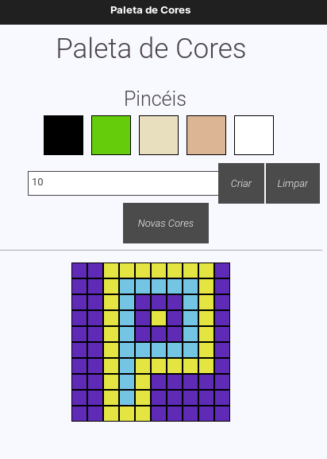

# Pìxel Art in PYTHON


<a href="https://github.com/marlondlacerda/pixel-art-in-python/commits/main"></a>


## Tópicos

[Preview](#preview)

[Sobre o Programa](#sobre-o-programa)

[Tecnologias](#tecnologias)

[Instalação e uso](#instalação-e-uso)

<br>

## Preview

<div align="center">

</div>
<br>


<br>

## Sobre o Programa

Dos mesmos criadores de [Pixel Art na Web](https://github.com/marlondlacerda/trybe-projetos/tree/main/fundamentals/bloco_5/pixel-art#readme), vem aí sua primeira versão em **Python**.

Comecei a estudar Python esse mês de junho de 2022 e para praticar e treinar resolvi criar uma aplicação que tivesse interface gráfica. Para ser um processo rápido, ao invés de criar algo do zero, resolvi pegar um projeto antigo e refazer ele em Python.

Usei Qt Designer e PyQt5 para criar a interface, apesar de ter demorado a entender como funciona, isso facilitou a minha vida.

## Tecnologias

Tecnologias e ferramentas utilizadas no desenvolvimento do projeto:

### Principais:
- Python 3
- PyQt5
- Qt Designer
- Git
- GitHub

### Para o Desenvolvimento:
- Black
- Flake8
- Click

## Instalação e uso
```bash
# Abra um terminal e copie este repositório com o comando
git clone git@github.com:marlondlacerda/pixel-art-in-python.git
# ou use a opção de download

# Entre na pasta web com 
cd pixel-art-in-python

# Crie e ative o ambiente virtual com o comando
python3 -m venv .venv && source .venv/bin/activate

# instale as dependências com o comando
pip install -r dev-requirements.txt

# Rode o aplicação
python3 src/app.py
```

<br>

Esse projeto está sob a licença MIT. Veja o arquivo [LICENSE](/LICENSE) para mais detalhes.

---

Feito por [Marlon Lacerda](https://github.com/marlondlacerda)
